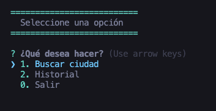
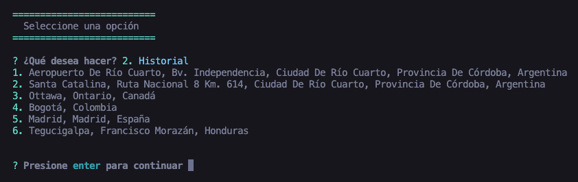

# Console App Of The Wheather

A simple console App to get the weather from a specific city by geo localization with different API's

## Description

A simple console App to get the weather from a specific city by geo localization with different API's

## Getting Started

### Dependencies

- `npm`
- `node`

### Installing

- Clone the repository and install dependencies:

```
git clone https://github.com/Felipe-Navas/console-app-of-the-wheather.git && cd console-app-of-the-wheather && npm install
```

### Executing program

```
npm start
```

Preview of the principal menu:



Preview of history:



### Running tests

```
npm test
```

## Authors

- [Felipe Navas](https://www.linkedin.com/in/felipenavaslederhos) - [Email](mailto:felipenavas.itec@gmail.com?subject=[GitHub]%20console-app-of-the-wheather)

## Contributing

1. Fork it (<https://github.com/Felipe-Navas/console-app-of-the-wheather/fork>)
2. Create your feature branch (`git checkout -b feature/fooBar`)
3. Commit your changes (`git commit -am 'Add some fooBar'`)
4. Push to the branch (`git push origin feature/fooBar`)
5. Create a new Pull Request

## License

This project is licensed under the [MIT License] - see the LICENSE file for details
